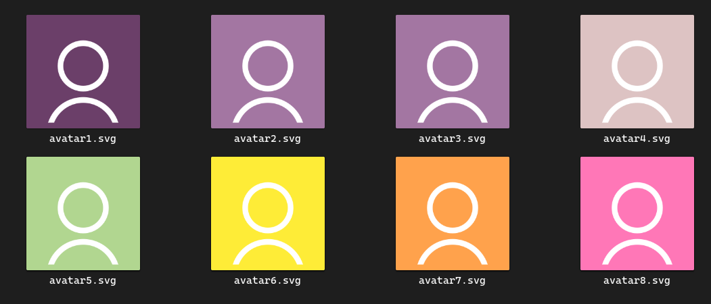
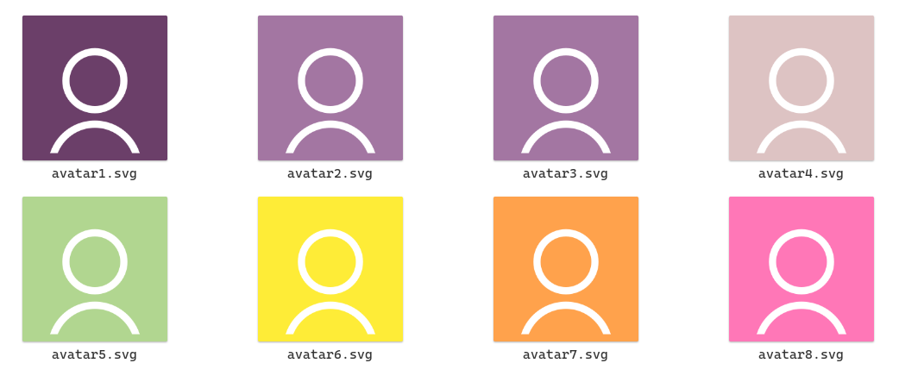

# usage:

```sh
$ git clone https://github.com/cartel-developer/avatar.git
$ cd avatar
$ bash avatar.sh [COLOR WITHOUT #]

# Example: bash avatar.sh 001BB7

```

### COLOR TYPE
#### hex without hashtag

example => black :
bash avatar.sh 000000

### Image




